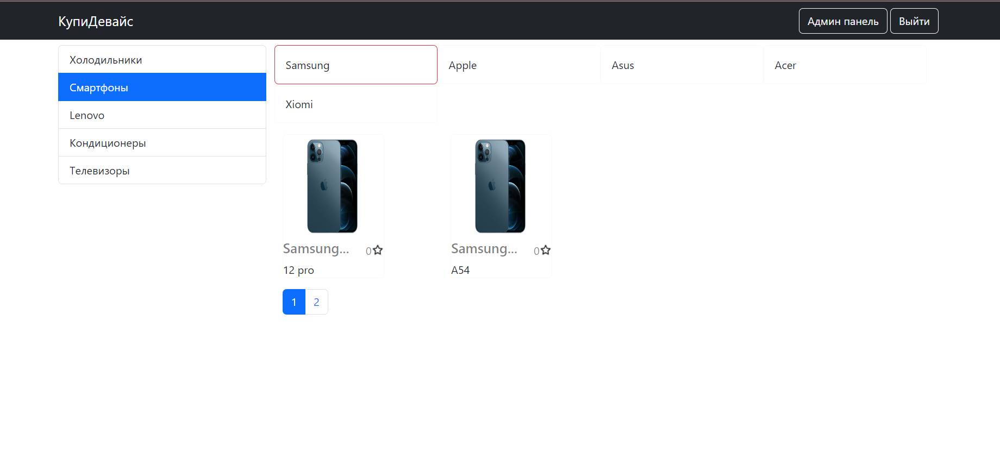
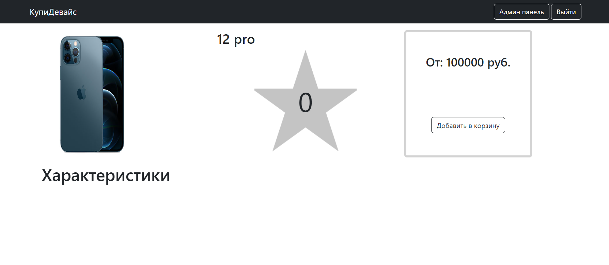
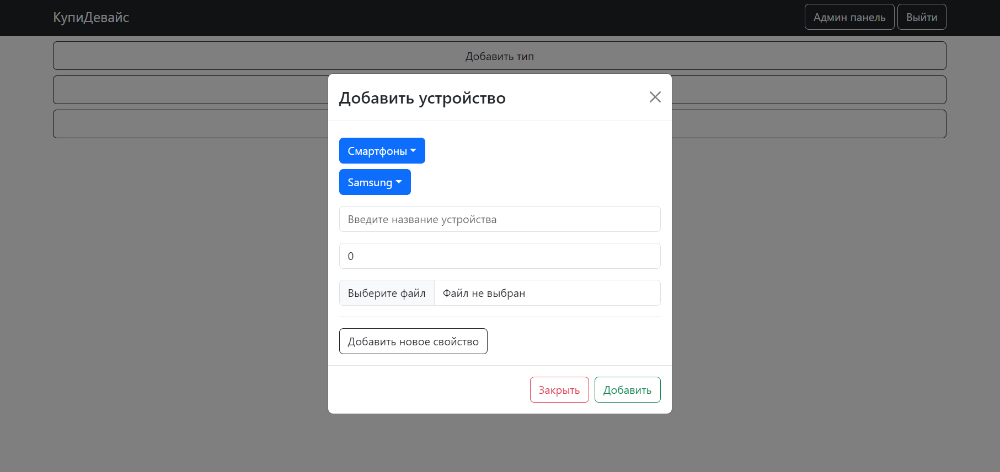

# Online Store

This project is an online store application that allows users to add new gadgets, sort them by brand and type, and check individual items. 
The backend is built using Express and PostgreSQL, while the frontend utilizes React, Axios, and react-bootstrap for visual elements.

## Features

- Add new gadgets to the store
- Sort gadgets by brand and type
- View detailed information about each gadget

## Installation

1. Clone the repository: `git clone <repository_url>`
2. Navigate to the project directory: `cd online-store`
3. Install dependencies: `npm install`

## Usage

1. Start the backend server: `npm run server`
2. Start the frontend development server: `npm start`
3. Open your browser and visit: `http://localhost:3000`

## Contributing

Contributions are welcome! If you would like to contribute to this project, please follow these steps:

1. Fork the repository
2. Create a new branch: `git checkout -b feature/your-feature`
3. Make your changes and commit them: `git commit -m 'Add your feature'`
4. Push to the branch: `git push origin feature/your-feature`
5. Submit a pull request

## License

This project is free to use for everyone. There is no license attached to it, allowing you to modify and distribute it as you please.
